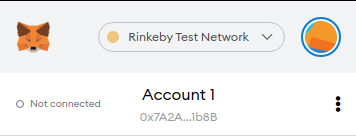
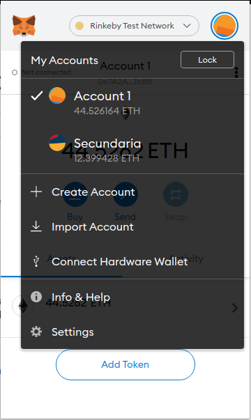
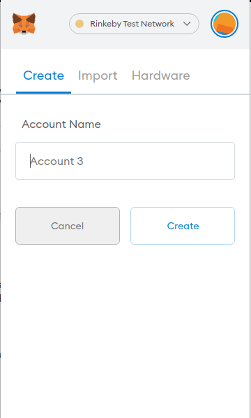
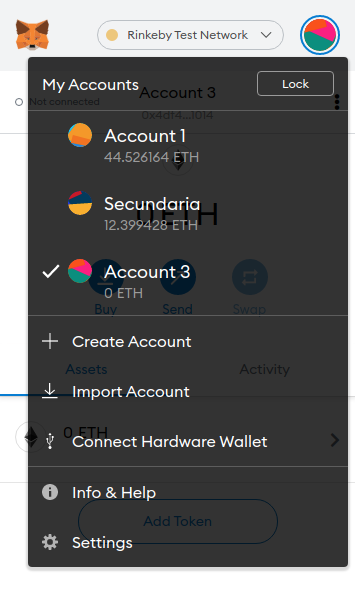
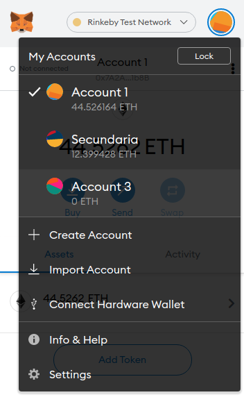

# Criando nova conta

Para seguir esse tutorial é necessário a instalação e configuração do [metamask](https://github.com/lifuesc/minicurso-blockchain/tree/main/Ferramentas/metamask/instalacao.md)

Com o MetaMask é possivel criar outras contas. Para isso abra o MetaMask clicando no seu icone.

Clique no icone da sua conta que fica do lado direito do nome da rede que está usando

Clique em `Create Account`

Preencha com o nome da conta, caso não deseje ele irá assumir um nome padrão

Uma vez criada ela está pronta para uso

Para alterar entre contas basta clicar no nome dela

