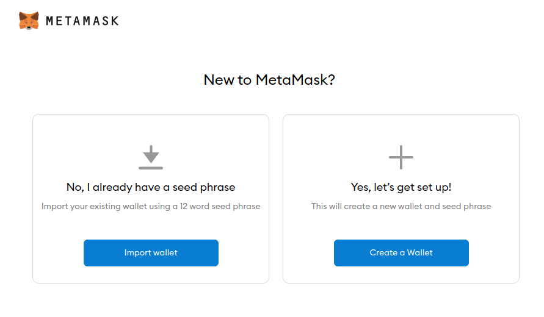
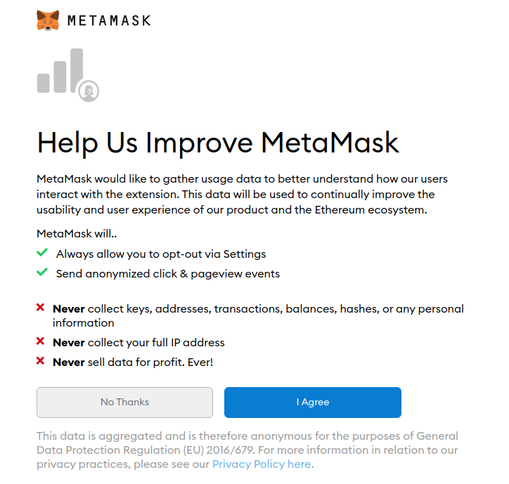
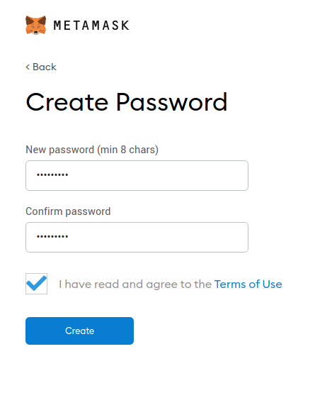
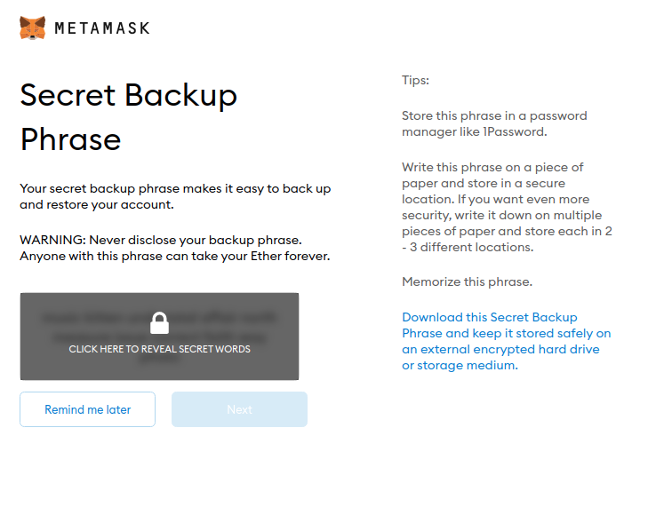
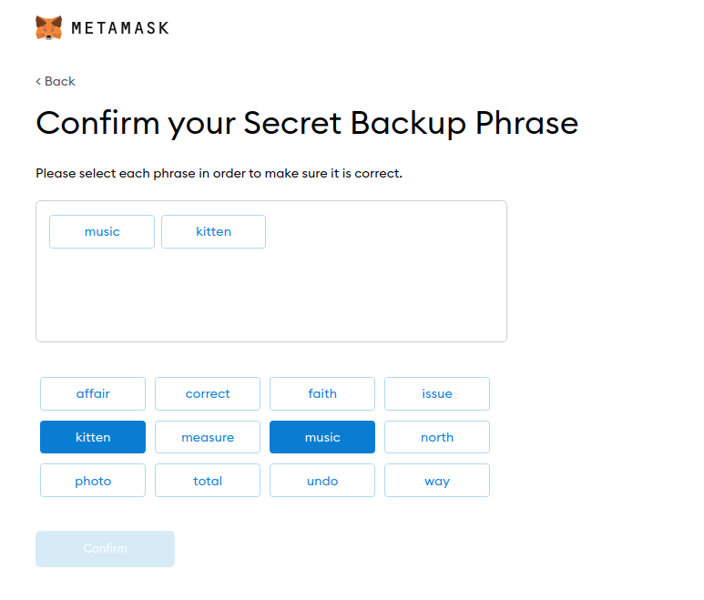
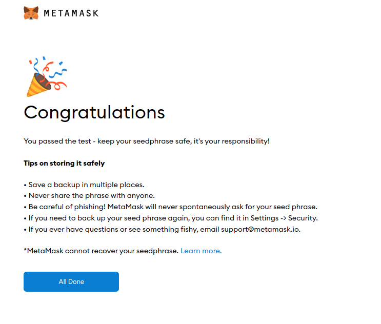
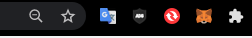
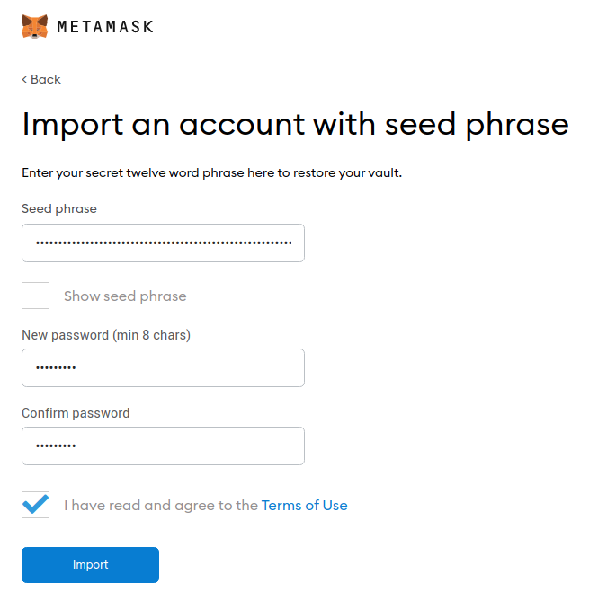

# Tutorial - Instalação metamask

1. [Instalação](#instalação)
   - [Google Chrome](#google-chrome)
   - [Firefox](#firefox)
   - [Opera](#opera)
   - [Safari](#safari)
2. [Configuração](#configuração)
   - [Primeiro acesso](#primeiro-acesso)

## Instalação

A extensão do metamask é suportada apenas nos navegadores google chrome, firebox, edge e brave. Aqui iremos utilizar o google chrome, mas se desejar instalar em outro navegador pode acessar o [site oficial](https://metamask.io/download.html) e baixar para seu navegador de preferência.

### Google Chrome

Abra o `chrome web store` e busque por metamask o [clique aqui](https://chrome.google.com/webstore/detail/metamask/nkbihfbeogaeaoehlefnkodbefgpgknn?hl=pt-BR).

Instale a extensão no seu navegador.

### Firefox

Abra o `firefox` e busque por metamask ou [clique aqui](https://addons.mozilla.org/pt-BR/firefox/addon/ether-metamask/)

## Configuração

### Primeiro acesso

Após a instalação vocẽ deve [criar uma nova carteira](#criando-carteira) ou [importar uma carteira ja existente](#importando-carteira).

Imagem da tela que irá aparecer no primeiro acesso

### Criando carteira

Após clicar em `Create a Wallet` você será redirecionado para a tela dos termos de uso

Preenchar com uma senha para o seu metamask

**Atenção nesse passo!** Você deve copiar suas palavras mnemonicas em um local seguro, que você sabe que não irá perder nos próximos meses/anos. Caso você perca elas você perderá todo acesso a sua carteira e terá que criar uma nova carteira.

Clique na ordem correta das suas palavras mnemonicas

Após essas configurações seu metamask já está pronto para uso

A extensão do metamask é localizada no canto superior direito do navegador ou nas opções de extensão

### Importando carteira

Após clicar em `import wallet` você será redirecionado para a tela dos termos de uso

Coloque as palavras mnemonicas da sua carteira e em seguida crie uma senha para o metamask

Após essas configurações seu metamask já está pronto para uso

A extensão do metamask é localizada no canto superior direito do navegador ou nas opções de extensão

