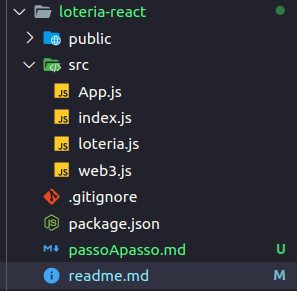

# Criando projeto

1. [Criando projeto](#comando-criação)
2. [Rodando projeto](#rodando-projeto)
3. [Alterando diretório](#alterando-diretório)

## Comando criação

Para seguir esse tutorial é necessário a instalação do [react](https://github.com/lifuesc/minicurso-blockchain/tree/main/Ferramentas/reactjs/instalacao.md)

Para criar um projeto em ReactJs basta rodar:

```shellscript
$ create-react-app nome-projeto
```

Podemos rodar, para versões do npm acima de `v5.1`, o seguinte comando:

```shellscript
$ npx create-react-app nome-projeto
```

O npx usa o pacote mais recente do `create-react-app` direto do site do `npm` sem precisa instalá-lo na máquina

Após rodar esse comando irá ser criado uma pasta de nome `nome-projeto` com essa estrutura:


## Rodando projeto

Após criado o projeto, entre no diretório raiz dele. Uma vez nele, rode:

```shellscript
$ npm start
```

A saida deve ser essa


## Alterando diretório

O diretório é dividido assim:


- `node_modules` _(Pasta com instalação de pacotes externos)_
- public _(Pasta com configuração html do site)_
  - favicon.ico _(Icone do site)_
  - index.html _(Arquivo com a estrutura base do HTML)_
  - logo192.png _(Logo react)_
  - logo512.png _(Logo react)_
  - manifest.json _(Arquivo que descreve seu app e configura para aplicações mobile)_
  - robots.txt _(Arquivo para robos CEO)_
- src _(Pasta com conteúdo do seu site)_
  - App.css _(Estilo do App.js)_
  - App.js _(Onde fica o código de sua aplicação)_
  - App.test.js _(Arquivo de teste)_
  - index.css _(Estilo de toda sua aplicação)_
  - index.js _(Arquivo que chama o component principal)_
  - logo.svg _(Logo)_
  - reportWebVitals.js _(Verifica performance do seu projeto e outras informações)_
  - setupTests.js _(Configuração para testes)_
- .gitignore _(Diz quais arquivos ou pastas não enviar para o github)_
- package.json _(Configuração do gerenciador de pacotes)_
- README
- package-lock.json (ou yarn.lock) _(Arquivo de configuração)_

Para nossos exemplos iremos usar essa estrutura:



Nessa estrutura não alteramos a pasta `public` e `node_modules`.

_Obs:_ Evite alterar a pasta `node_modules` pois são pacotes que são instalados automaticamente quando criado o projeto e quando se baixa algum módulo externo.

Nossa nova estrutura fica dessa forma:

- src _(Pasta com conteúdo do seu site)_
  - App.js _(Onde ficará o visual do nosso site)_
  - index.js _(Configura o react e chama o App.js)_
  - loteria.js _(Configuração do contrato loteria)_
  - web3.js _(Configuração do web3)_

Em nosso padrão iremos usar o nome das pastas e arquivos em minúsculo, exceto se for um component.
